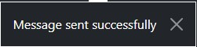

# John Breedon Bass Tuition

John Breedon Bass Tuition offers tutoring services to people who want to learn to play bass guitar. The website is a means of learning more about the tutoring service and the tutor himself, as well providing functionality for users to book lessons and leave testimonials.

The website was built using the Django framework and is fully responsive. The goals of the website are:

**Site Owner**

- To advertise tutoring services
- To enable current and potential learners to contact the owner
- To enable learners to interact with the website
- To enable learners to book lessons

**Site Users**

- To learn more about the tutoring services/tutor
- To be able to easily ask the site owner questions
- To be able to interact with the website
- To be able to easily book lessons

## Live Site

The live site can be found [here](https://john-breedon-bass-tuition.herokuapp.com/).

- [Agile Methodology](<#agile-methodology>)
	- [Feasibility Matrix](<#feasibility-matrix>)
	- [Epics and User Stories](<#epics-and-user-stories>)
		- [Provide information and enable contact](<#provide-information-and-enable-contact>)
		- [Enable Accounts](<#enable-accounts>)
		- [Enable Testimonials](<#enable-testimonials>)
		- [Enable Bookings](<#enable-bookings>)
		- [Provide Learning Materials](<#provide-learning-materials>)
	- [Acceptance Criteria](<#acceptance-criteria>)
	- [Tasks](<#tasks>)
	- [User Story Management](<#user-story-management>)
- [Features](<#features>)
	- [Home Page](<#home-page>)
		- [Navbar](<#navbar>)
		- [Homepage Header](<#homepage-header>)
		- [Homepage Cards](<#homepage-cards>)
		- [Homepage Prices](<#homepage-prices>)
		- [Contact Form](<#contact-form>)
		- [Footer](<#footer>)
	- [About Page](<#about-page>)
	- [Register](<#register>)
	- [Sign In](<#sign-in>)
	- [Sign Out](<#sign-out>)
	- [Bookings Page](<#bookings-page>)
		- [Booking Form](<#booking-form>)
		- [Booking Availability](<#booking-availability>)
	- [Account Page](<#account-page>)
		- [Profile Form](<#profile-form>)
		- [Account Bookings](<#account-bookings>)
		- [Testimonial](<#testimonial>)
	- [General](<#general>)
		- [Security](<#security>)
		- [User Experience](<#user-experience>)
	- [Design](<#design>)
		- [Colours](<#colours>)
		- [Typography](<#typography>)
		- [Imagery](<#imagery>)
		- [Wireframes](<#wireframes>)
- [Database Schema](<#database-schema>)
	- [Contact](<#contact>)
	- [LearnerProfile](<#learnerprofile>)
	- [Testimonial](<#testimonial>)
	- [Booking](<#booking>)
- [Technologies](<#technologies>)
	- [Development Technologies](<#development-technologies>)
	- [Testing Technologies](<#testing-technologies>)
- [Testing](<#testing>)
	- [Automated Testing](<#automated-testing>)
	- [Manual Testing](<#manual-testing>)
	- [Validation](<#validation>)
- [Bugs and Issues](<#bugs-and-issues>)
	- [Floating Label issue](<#floating-label-issue>)
	- [Background Image issue](<#background-image-issue>)
	- [LearnerProfile Bug](<#learnerprofile-bug>)
	- [Email required Bug](<#email-required-bug>)
	- [Update Booking Bug](<#update-booking-bug>)
- [Deployment](<#deployment>)
	- [Django](<#django>)
	- [Heroku](<#heroku>)
- [Credits and Resources](<#credits-and-resources>)
	- [Code](<#code>)
	- [Learning Resources](<#learning-resources>)
		- [Videos](<#videos>)
		- [Websites](<#websites>)
	- [Content](<#content>)
	- [Media](<#media>)
	- [Acknowledgements](<#acknowledgements>)

## Agile Methodology

An Agile methodology was used throughout the planning and development of the website, in this section I will explain the different tools that I used and the tasks that I completed to ensure I was working in an Agile way.

### Feasibility Matrix

At the start of the project, I listed out all of the potential goals of the website. I then assigned each goal (or opportunity) an importance and viability score which enabled me to create a feasibility matrix as below:

This table enabled me to see that the importance was greater than the viability, so I knew I wouldn't be able to implement everything. Plotting the table onto a chart helped me see which elements I would need to leave out:

At this point, I decided that the development of downloading learner materials and commenting on them would be deprioritised in favour of the other opportunities.

The feasibility matrix can also be seen in the [associated excel document](docs/project/user-story-and-feature-prep.xlsx) on the tab named 'Feasibility Matrix'.

### Epics and User Stories

Following the feasibility matrix, I used the opportunities to determine what my Epics were, which meant that I had the following:

- Provide information and enable contact
- Enable Accounts
- Enable Testimonials
- Enable Bookings
- Provide Learning Materials

I then broke each Epic down into User Stories:

#### Provide information and enable contact
- As a site user, I want to be able to view information about the tutoring service, so that I can make an informed decision about using it
- As a site user, I want the information to be responsive on different devices, so that I can view it on different devices
- As a site user, I want to be able to contact the tutor, so that I can ask questions
- As an admin, I want to be able to manage contact messages, so that I know what I need to respond to

#### Enable Accounts
- As a site user, I want to be able to register an account, so that I can use the site functionality
- As a site user, I want to be able to log in and out of the site, so that I can have control over my account
- As a site user, I want to be able to see my account information, so I can remind myself of the information I entered
- As a site user, I want to be able to update account information, so I can keep my details up to date

#### Enable Testimonials
- As a site user, I want to be able to view testimonials about the service, so that I can make an informed decision about using it
- As a site user, I want to be able to create a testimonial, so that I can share my experience with other users
- As a site user, I want to be able to update a testimonial, so that I can fix any mistakes I have made
- As a site user, I want to be able to delete a testimonial, so that I can control what I have written
- As an admin, I want to be able to approve testimonials, so that I can filter out objectionable testimonials

#### Enable Bookings
- As a site user, I want to be able to view booking availability, so that I can find a time to book that suits me
- As a site user, I want to be able to book a session, so that I can make use of the tutoring service
- As a site user, I want to be able to update a booking, so that I change bookings in line with my schedule
- As a site user, I want to be able to delete a booking, so that I can cancel any bookings I can no longer make
- As a site user, I want to be able to view any bookings I have made, so that I can remind myself of what I have booked
- As an admin, I want to be able to delete a booking, so that I can cancel any bookings I can no longer make
- As an admin, I want to be notified of any bookings that have been cancelled, so that I can plan my schedule accordingly
- As an admin, I want to limit the lessons a learner can book in a day, so that there is availability for all students

#### Provide Learning Materials
*Note that this hasn't been implemented*
- As a site user, I want to be able to download learning materials, so that I can enhance my learning progress
- As a site user, I want to be able to comment on learning materials, so that I can share my experience of how useful they are
- As a site user, I want to be able to like learning materials, so that I can interact with the content
- As an admin, I want to be able to create learning materials, so that they can be shared with learners

Using the MoSCoW method, I assigned each story a priority to help me determine the order of development (note that as the Provide Learning Materials Epic was deprioritised, these stories were given a 'W' for "won't have").

In addition, I assigned each story a story points value based on how long I thought they would take to implement in order to make sure that none of the 'should haves' or 'could haves' were likely to take up a disproportionate amount of time. The break down of story points was:

- Must haves: 32 (59%)
- Should haves: 14 (26%)
- Could haves: 8 (15%)

The Epics, User Stories and associated MoSCoW/story points can also be seen in the [associated excel document](docs/project/user-story-and-feature-prep.xlsx) on the tab named 'User Stories'.

### Acceptance Criteria

Once I had my User Stories, I worked through these to break them down into Acceptance Criteria. The purpose of this was to provide a reference point for the development to ensure that what was being implemented is actually what was needed. It also helped with Testing to ensure that all necessary scenarios were covered.

I have provided an example of some acceptance criteria below, the full list for each user story can be seen in the [associated excel document](docs/project/user-story-and-feature-prep.xlsx) on the tab named 'User Story AC'.

**As a site user, I want to be able to contact the tutor, so that I can ask questions**
- Ability to contact should be presented as a Contact Form
- Fields should include Name, email address, phone, and message
- Form should appear on the homepage
- Form should contain standard validation to ensure fields are completed
- Once submitted, a confirmation message should be provided

### Tasks

When working on each User Story, I broke them down into Tasks to identify the technical work required to implement the story. This helped keep the development focussed as well as ensuring I didn't miss any technical elements.

I have provided an example of the tasks for a User Story below, the full list for each user story can be seen in the [associated excel document](docs/project/user-story-and-feature-prep.xlsx) on the tab named 'User Story AC'.

**As a site user, I want to be able to contact the tutor, so that I can ask questions**
- Create Contact Model
- Include Contact Model in admin
- Create Contact Form template
- Include contact form submission in view code
- Implement crispy forms configuration
- Add confirmation message
- Auto-scroll to form when there are errors
- Reset form when it is valid and successful

### User Story Management

To manage the User Stories for the project, I created a Github Project with a Kanban board, which can be seen [here](https://github.com/users/adamhatton/projects/3/views/1).

Each of the stories was added to the project using a User Story template, and then allocated to the relevant column. I included the "won't have" stories and left these in the backlog column to indicate that they could be completed in the future but will not be worked on in this iteration of the website.
All the other stories were put into the 'To Do' column, being moved into the 'In Progress' column when they were in development, and then moving into 'Testing' once the development was complete. All of the stories that were tested were moved into the 'Done' column.

Using this tool helped me to keep track of the status of each story, as well as keeping on top of how many stories were left to complete. You can see from the board that due to time constraints I had to leave the two 'could have' stories in the To Do column in order to successfully deliver the 'must have' and 'should have' stories.

[Back to top ⇧](#john-breedon-bass-tuition)

## Features

### Home Page

#### Navbar

- To allow easy navigation around the site there is a fixed Navbar at the top of the page with all relevant links. The logo text (JB Tuition) links back to the home page in accordance with standard user experience
- Each of the links is highlighted orange when that particular page is active so the user can easily see where they are
- The Navbar uses bootstrap classes and is fully responsive, collapsing to a drop down on smaller screens
- When the user is logged in they get access to some additional pages
- As the Home Page and Contact Page are within the same template, a ScrollSpy has been implemented with vanilla Javascript so that the active page class changes when scrolling to the relevant section
- In addition to the ScrollSpy, when the user selects 'Contact' from the Navbar, a vanilla Javascript script automatically scrolls the page to the Contact Section

#### Homepage Header

- On the homepage the user is immediately presented with a large image of a person playing bass guitar and two call to action buttons
- This encourages the user to sign up, or if they already have an account, they are quickly able to access the bookings screen
- When a user is logged in, the 'sign up' button is hidden

#### Homepage Cards

- Below the homepage header are three bootstrap cards which explain what the tutoring service is and what John Breedon has to offer
- The cards have a heading and subheading to prime the user's expectations about the information in the cards
- The cards have concise information and an associated image to help keep the aesthetic simple and punchy without requiring much reading
- The cards use bootstrap classes and are therefore responsive on different screen sizes

#### Homepage Prices

- Below the home page cards is the prices section with a simple 'Prices' title
- There are two cards in this section showing the prices for tutoring services
- The information is simple and clean so it is immediately clear to the user what the cost of the service is
- There are buttons which link to the relevant actions to encourage users to either book a lesson or contact the tutor
- The cards use bootstrap classes and are therefore responsive on different screen sizes

#### Contact Form

- The homepage also contains a contact form that any visitor can use to send a message to the tutor
- As it is on the home page, when the user selects the 'Contact' navlink there is a script in place to scroll the view to the form
- The form implements bootstrap floating fields via the django crispy forms `crispy-bootstrap5` library
- Name, Email and Message are required, but the Phone is not. However, if a user enters an invalid phone number the form will not submit and they will be asked to enter a valid one. This is because the field is a `PhoneNumberField` implemented via the django `phonenumber-field` library
- When a message is sent, the user gets a success message, providing them with instant feedback about their actions
- On submission, a contact message is generated in the database and accessible by the site admin

#### Footer

- Each page has the same footer at the bottom, containing links to the tutor's Facebook and YouTube channels (note that these are for illustration purposes only, the channels do not exist)
- Each of the links opens in a new tab so that the user does not lose where they were
- The footer uses CSS styling to always appear at the bottom of the window, even if there is minimal content (for example on a login page)

### About Page

- On the about page there is a header containing biographical information and a picture of the tutor, this is responsive so that the picture goes below the text on smaller screens
- Below the header is the testimonials section. This takes a random selection of testimonials from the database (up to 8) and renders them in bootstrap cards, the random selection will run on each load of the page
- As the testimonial cards use bootstrap classes, they are responsive across screen sizes 
- The about page helps the user to quickly and easily learn more about the tutor and see the experiences of other learners

### Register

- Users can register with the website in order to access additional functionality
- The website uses the django `allauth` library which provides views and templates for registering
- The register screen has been styled to match the rest of the website and provides the standard registering functionality
- The email address has been set to be required so that the tutor has a confirmed means of contacting any learners who book lessons
- Users receive a sign-in message once they have successfully registered giving them immediate feedback on their actions

### Sign In

- The website uses the django `allauth` library which provides views and templates for signing in
- The sign-in screen has been styled to match the rest of the website and provides the standard signing in functionality
- Users receive a sign-in message once they have successfully signed-in giving them immediate feedback on their actions

### Sign Out

- The website uses the django `allauth` library which provides views and templates for signing out
- The sign-out screen has been styled to match the rest of the website and provides the standard signing out functionality
- Users receive a sign-out message once they have successfully signed-out giving them immediate feedback on their actions

### Bookings Page

#### Booking Form

- The booking form enables learners to book a lesson with the tutor for any available slot in the next 7 days. The required fields for this form are: Date, Time and Type
- The Date field has a date picker widget, and this has been restricted to only dates in the next 7 days to prevent users making bookings in the past or too far in advance
- The other required fields have been set up as choice fields in the database, so the user is unable to input invalid information
- The phone field is not required, but if an incorrect number is entered the user will be asked to enter a valid number
- When a user presses any of the available slot buttons (see below), this will populate the form with the date and time for that slot
- A message will be shown when a successful booking is made
- If a user tries to book a slot that is already booked, they will be given a message asking them to select a different slot

#### Booking Availability

- Below the booking form is the availability section. This shows the booking slots for the next 7 days
- The availability is taken from the database and rendered as buttons for each slot. If the slot is booked, the button colour is changed and it becomes unselectable
- When a user presses the button for an available slot, the booking form is populated with the time and date for this slot
- This section uses bootstrap column classes to be responsive and condense the buttons on smaller screens

### Account Page

#### Profile Form

- At the top of the account page is the profile form, which shows the user's account information along with some additional information fields that they can provide if they want to
- The structure of the form is actually 2 forms in one: a `User` form and a `LearnerProfile` form. On pressing submit, both forms are validated, only username and email are required, other fields do not need to be populated but will provide validation errors if they are populated with invalid data
- By default the fields are set to be disabled (via a crispy forms Layout), but if the user selects the Edit button the fields become editable via a script. They can cancel the edit which will refresh the page and remove any changes they made
- If a user tries to submit some changes and receives validation errors, the page will reload and the fields will render as editable to prevent them having to enable the fields again
- On successful submission a message is provided to say that the profile has been successfully updated

#### Account Bookings

- Below the profile form, the user can see any existing bookings that they have. If they have none, there will be a message to say that they have no current bookings
- The bookings will be shown with the earliest booking first, and any past bookings will not render to the template
- The user is able to update a booking, which will take them to the bookings page and prepopulate the form with the data for that booking
- Users can also delete bookings, but they will be prompted to confirm the deletion via a pop-up modal

#### Testimonial

- The final section on the Account page is the testimonial. By default this is just a button that says 'Add', when pressed this reveals a textbox where the user can type out a testimonial
- If the user submits a testimonial they will be prompted to confirm they want to add it, and if they continue they are shown a message that their testimonial has been submitted for approval. This message will also be shown in the testimonial section until the testimonial is approved
- Once a testimonial is approved, a user can edit what they've written (which follows the same process as adding a testimonial), or they can delete it. Deleting a testimonial also prompts a user to confirm that they want to delete it

### General

#### Security

- In order to properly interact with the website, a user needs to have an account and be logged in. None of the following are possible unless a user is authorised: Creating and amending bookings, adding a testimonial, adding profile information. If an unauthorised user tries to access any of these links they will be redirected to a sign up page
- During development I identified that bookings could be edited or deleted by a different user if they accessed the url directly through their browser (i.e. by typing it in). To defend against this, I have implemented checks that the booking user and the user requesting the action are the same. If they are not, a message saying that they do not have permission is shown

#### User Experience

- For the Testimonial form, users are asked if they want to confirm the submission. This is because the information is not editable until after it gets approved, so acts as a barrier against accidental clicks, this was done by overriding the form's submission method and attaching a JavaScript function
- Other forms do not require the submission to be confirmed as the information is easily editable after submission so I decided to avoid having the user having to complete an additional click
- All delete buttons require the user to confirm the deletion, this is to protect against accidental deletions

[Back to top ⇧](#john-breedon-bass-tuition)

### Design

#### Colours

The below colours have been used throughout the website:

Most of the colours are from the bootstrap5 palette and have been used as they provide a clean and professional aesthetic. In place of the standard 'bootstrap blue', I have used a bold orange colour. This provides a strong contrast with the other colours, and is very useful for drawing attention towards key focus points such as buttons and links.

I have kept the colour palette simple to avoid creating visual noise and to help keep focus on the information being presented.

#### Typography

The font used is the default bootstrap 5 font, which provides a "native stack" for every device and OS. I opted to use this due to the fact that it provides an optimal experience on each device, but also due to the fact that it is a familiar font. These fonts provide a professional yet approachable aesthetic that I did not want to change.

#### Imagery

There is limited imagery on the website and it is used as supporting content for the text. The images are all muted in terms of colours in order to fit with the theme of the website and to help with the contrast of the bold orange.

- The main image on the home page is of a person playing bass guitar and is used to immediately set the context for the website
- The three card images on the home page are all representations of the information presented below them
- The image on the About page is of the tutor, so that learners can see what he looks like

All images were taken from [Pexels](https://www.pexels.com/).

#### Wireframes

The wireframes for the website can be seen below, these were generated at the start of the project. Due to the amount of information to be included in the site, I decided that multiple pages were more appropriate than a single page with scrolling.

To create the wireframes, I looked at different bootstrap templates and used these as inspiration for dividing the pages into the different relevant sections. I used a combination of standard user experience and what my own expectations would be to design and place the different elements on each page.

The finished website does not mirror the wireframes exactly as I made some design changes during development. The key changes I made were:

- Originally the testimonials were duplicated on the homepage and the about page, I decided this information should only be in one place so removed it from the home page
- The prices were originally on the about page, during development I decided that users would likely want to see this information immediately so moved it to the homepage
- I decided to change the layout of the booking availability slots as my original intention for displaying this information did not make best use of the available space

Homepage Wireframes

About Wireframes

Bookings Wireframes

Account Wireframes

[Back to top ⇧](#john-breedon-bass-tuition)

## Database Schema

The database schema can be seen below:

### Contact

This model stores contact messages that are sent in from any website visitor:

- Name, email address and message are required fields so that the site owner doesn't receive blank messages, but also to ensure that there is an email address available for response
- The phone number field holds the visitor's phone number. It is available in the contact form if users are happy to provide it as it is a faster means of communication, however it is not required - this is so that users only have to enter minimal information before being able to send a message. The phone number field was implemented using the `django-phonenumber-field` library with the default region set to Great Britain to enable validation for GB numbers
- The submitted and completed fields are for management in the admin site. The submitted field uses the django `auto_now_add` feature to populate the date and time contact was sent which allows the site owner to see this in the admin site. The completed field is a Boolean field that the site owner can use to mark a message as having been responded to

### LearnerProfile

This model extends the user model via a OneToOne relationship and stores additional information that users provide about themselves:

- LearnerProfile is linked to a specific user via a OneToOne relationship with the UserModel. When a User is created, the LearnerProfile is automatically created as well via the model receiving a signal from the User save function. Because of this, if a LearnerProfile gets deleted it can cause issues with logging into the admin site. To overcome this I removed the option to delete the LearnerProfile unless the full user was being deleted
- The ability level stores the learner's playing ability. It is a CharField which takes the choices 'Beginner', 'Intermediate' and 'Advanced'. This allows the user to provide information on their current playing ability so that the site owner knows what to expect in lessons. The field is not required
- The about field is a TextField which is intended to store any additional information that the user provides about themselves and their goals. Again this helps the site owner to prepare for lessons. The field is not required
- The phone field stores the user's phone number and is implemented using the `django-phonenumber-field` library. It is not required, but if the user enters it then it will be prepopulated into the booking form for any bookings they make. It is included as it is a faster method of communication if the user is happy to share it

### Testimonial

This model stores testimonials that are added by learners. This also extends the user model via a OneToOne relationship, and the reason it has been separated from the LearnerProfile is for easier management of testimonials within the admin site. This information is used as advertisement on the website and each testimonial needs to be approved, it is easier to manage this process when the testimonials can be seen in isolation. They are not relevant to the LearnerProfile which the site owner will use to get a better understanding of the learner:

- Testimonial is linked to a specific user via a OneToOne relationship with the User model. However, it is not automatically created when the user is created so it can be deleted without causing any issues
- Content is a TextField which stores a testimonial if the user writes one. This field is required
- Created_on and updated_on use the django `auto_now_add` feature to populate the date that adding/changing occurs. This information is useful for the site owner to see in the admin site
- Approved is a BooleanField that sets whether the testimonial is approved or not. This allows the site owner to screen testimonials. When a testimonial is submitted the user will be told it has been sent for approval, only once the site owner has approved the testimonial will it appear in the learner's account page and on the about page.

### Booking

This model handles bookings made by learners:

- As one user can have multiple bookings, the Booking model is linked to the User model via a ForeignKey enabling users to make multiple bookings.
- Date stores the date on which the lesson will take place. It is a required field and is implemented with a DateField. On forms this field is implemented via a datepicker which limits entries to valid dates.
- Time stores the time of the lesson. It is a CharField which takes the choices '10:00 - 11:00', '11:00 - 12:00', '13:00 - 14:00', '14:00 - 15:00', '15:00 - 16:00', '16:00 - 17:00'. It is a required field.
- The phone field stores the user's phone number and is implemented using the `django-phonenumber-field` library. The reason this field has been included in this model as well as the LearnerProfile model is that it is not a required field in either model, so the LearnerProfile phone field cannot be relied on to be available. Having phone in the Booking model provides the user more flexibility to provide temporary numbers and acts as a backup for when it is not available from the LearnerProfile model
- Type stores the type of the lesson. It is a CharField which takes the choices 'Home Visit', 'Online', 'At the Studio'. It is a required field.
- Created_on and updated_on use the django `auto_now_add` feature to populate the date that adding/changing occurs. This information is useful for the site owner to see in the admin site

[Back to top ⇧](#john-breedon-bass-tuition)

## Technologies

### Development Technologies

**Languages**
- [CSS](https://en.wikipedia.org/wiki/CSS)
- [HTML5](https://en.wikipedia.org/wiki/HTML5)
- [JavaScript](https://en.wikipedia.org/wiki/JavaScript)
- [Python](https://en.wikipedia.org/wiki/Python_(programming_language))

**Frameworks**
- [Bootstrap5](https://getbootstrap.com/docs/5.0/getting-started/introduction/) - used for styling the site and making it responsive on different devices
- [Django](https://www.djangoproject.com/) - used to build the database and the structure/logic of the site

**Libraries**
- [Allauth](https://django-allauth.readthedocs.io/en/latest/index.html) - used for implementing account authorisation and providing associated templates
- [Black](https://github.com/psf/black) - used for python code formatting
- [Coverage](https://coverage.readthedocs.io/en/6.4.4/) - used for assessing how much code is covered by the automated tests
- [Crispy forms](https://github.com/django-crispy-forms/django-crispy-forms) and [Crispy bootstrap5](https://github.com/django-crispy-forms/crispy-bootstrap5) - used for styling forms in the Django templates
- [Django Phonenumber Field](https://github.com/stefanfoulis/django-phonenumber-field) - used for implementing phone number field storage and validation
- [Font Awesome](https://fontawesome.com/) - used to add icons for links to different social media sites
- [Gunicorn](https://gunicorn.org/) - used for a WSGI HTTP server for the website

**Tools**
- [Aspect Ratio Calculator](https://calculateaspectratio.com/) - used for determining how big images needed to be based on their ratio
- [Balsamiq](https://balsamiq.com/) - used to create the initial wireframes of the website
- [Chrome DevTools](https://developer.chrome.com/docs/devtools/) - used throughout the process for testing the responsiveness of the website, debugging issues, experimenting with layout/style choices, and debugging JavaScript issues
- [Cloudconvert](https://cloudconvert.com/) - used to convert the images to .webp format
- [Cloudinary](https://cloudinary.com/) - used to store and serve the static files
- [Coolors](https://coolors.co/) - used to obtain a visual chart of the colours used
- [Contrast Checker](https://webaim.org/resources/contrastchecker/) - used for checking the contrast of text and backgrounds
- [Favicon](https://favicon.io/favicon-generator/) - used for creating a favicon for the site
- [Gitpod](https://www.gitpod.io/) - used to write and develop the website
- [Git](https://git-scm.com/) – used for version controlling by using the Gitpod terminal to commit to Git, and subsequently pushing to GitHub
- [GitHub](https://github.com/) – used to store the source code for the application
- [Heroku](https://www.heroku.com/) - used to host and deploy the live website
- [Miniwebtool](https://miniwebtool.com/django-secret-key-generator/) - used for generating a Django secret key
- [Techsini](http://techsini.com/multi-mockup/) - used to generate a multi-device mockup (as seen at the beginning of the README)

### Testing Technologies

- [Jigsaw CSS validator](https://jigsaw.w3.org/css-validator/) - used for validating the CSS stylesheet
- [JSHint](https://jshint.com/) - used for validating the JavaScript code
- [Lighthouse](https://developers.google.com/web/tools/lighthouse) - used for analysing the performance, accessibility, best practices and SEO of the website
- [PEP8 online](http://pep8online.com/) - used to check that the Python code meets PEP8 standards
- [W3C HTML validator](https://validator.w3.org/) - used for validating the HTML markup
- [WAVE Web Accessibility Evaluation Tool](https://wave.webaim.org/) - used for checking web accessibility

[Back to top ⇧](#john-breedon-bass-tuition)

## Testing

The testing was broken down into three categories: automated, manual, and validation. A separate document detailing the testing can be found [here](TESTING.md), but a summary is below.

### Automated Testing

I wrote automated tests to cover the essential aspects of each Django app. I completed testing on each app's `forms.py`, `models.py` and `views.py`. This covered all the essential tests such as ensuring that views rendered the correct templates and redirected where required, forms were only considered valid when the required information is entered, and that all custom code within models works as expected.

### Manual Testing

I manually tested the website on 3 different browsers: Chrome, Desktop, Edge. In addition I also tested it on my own mobile, and had a number of friends and family test it on their own devices. Due to the testing performed by others, there are a number of accounts and entries that already exist in the database.

This testing consisted of checking:

- The website functioned as expected
- All links were working
- Forms could be submitted
- JavaScript functioned as expected
- Feedback messages were provided where expected

### Validation

I validated all aspects of my codes as follows:

- Python via [PEP8 online](http://pep8online.com/)
- HTML via the [W3C HTML validator](https://validator.w3.org/)
- CSS via the [Jigsaw CSS validator](https://jigsaw.w3.org/css-validator/)
- JavaScript via [JSHint](https://jshint.com/)
- Accessibility via the [WAVE Web Accessibility Evaluation Tool](https://wave.webaim.org/)
- Site performance via [Lighthouse](https://developers.google.com/web/tools/lighthouse)

[Back to top ⇧](#john-breedon-bass-tuition)

## Bugs and Issues

### Floating Label issue

Throughout development I had used the bootstrap5 'floating label' component for all form inputs, however this caused issues when validating the HTML for the date `<input>` and the `<select>` elements. The floating label component uses a placeholder attribute but date `<input>`s and `<select>` elements cannot have placeholder values. The fields are all rendered via `crispy forms` and the templates automatically add a 'placeholder' attribute, regardless of the input type.
In order to meet HTML standards, I opted to remove the floating label component for these fields, and use standard labels instead. I considered using raw HTML within a crispy forms Layout object to resolve the problem, but this would require a verbose amount of code and would be more difficult to maintain in the future. As such, I decided to sacrifice some of the aesthetic consistency in favour of cleaner code that meets HTML standards.

### Background Image issue

The homepage has a header which contains a background image. When I tried to add the background image via a linked CSS stylesheet, I encountered an error whereby the resource could not be served by Cloudinary (which is the service used to store and serve static files). The error was caused by Cloudinary being unable to directly read the url as it was within a linked CSS file. To overcome this, I added the background image via a style element directly in the HTML, along with a comment to explain why it wasn't contained within the linked CSS stylesheet.

### LearnerProfile Bug

During development after I had implemented the LearnerProfile model, I found there was an error when trying to login to the site with a user that didn't have a LearnerProfile model. The LearnerProfile model is automatically created when a User is created, but for users who had been created prior to the implementation of this model or for those where the LearnerProfile model had been deleted, trying to login caused an error that the LearnerProfile does not exist.
In order to fix this, I made it so that the LearnerProfile cannot be deleted by itself with the following code in the `admin.py` file:
~~~
    def has_delete_permission(self, request, obj=None):
        '''
        Disable delete button for LearnerProfiles to prevent issues
        with login
        '''
        if (
            f'{LearnerProfile._meta.app_label}/'
            f'{LearnerProfile._meta.model_name}'
            in request.path
        ):
            return False
        return True
~~~

### Email required Bug

When a user signs up I have made the email field a requirement so that the site owner has a guaranteed method of being able to contact the user. This was done via the AllAuth framework. However, when implementing a user form in the account page to allow users to update their information, I found that the email field was not required due to it coming from the standard Django form.
To overcome this I changed the UserForm in `learner_account.forms.py` so that it would add a 'required' attribute to the form input:
~~~
self.fields['email'].required = True
~~~
This makes it so that the form input is required before submission.

### Rendering Bookings Bug

When writing my automated tests, I found that the test for rendering bookings on the account kept failing, despite my manual testing suggesting it was working. The learner_account.html template receives a context variable that is all the bookings that are linked to that user. If the length of this variable is greater than 0, it iterates through them to render some html elements.

Originally the code looked as follows:
~~~

	
		<Add html elements>
	

~~~

`len` had been incorrectly used, but was not apparent through manual testing. After the automated testing, I updated the template code to instead use a Django filter:

~~~

	
		<Add html elements>
	

~~~  

### Update Booking Bug

When reviewing my code with my mentor, he highlighted a use case scenario that had not been accounted for, in that a user may want to just update their lesson *type* without updating the lesson *time*. I had not considered this as a use case and had explicitly blocked it in the `bookings.py` by preventing an update occurring if a booking with the same date and time already existed. Originally the code looked like this:
~~~
def post(self, request, booking_id):
	'''
	Handles POST requests to the edit_bookings page
	'''
	queryset = Booking.objects.all()
	booking_to_edit = get_object_or_404(queryset, pk=booking_id)
	booking_form = BookingForm(request.POST, instance=booking_to_edit)

	date = request.POST['date']
	time = request.POST['time']

	# Check if booking already exists
	if queryset.filter(date=date).filter(time=time).exists():
		messages.error(
			request,
			'That slot is unavailable, please select a different time'
		)
		return redirect(reverse('edit_booking', args=[booking_id]))
~~~

To account for the new use case, I amended the code to include a check that if an existing booking is found, that the primary key for this booking has to be different in order to reject the update:
~~~
# Prevent user selecting booked slots that aren't the existing slot
if queryset.filter(date=date).filter(time=time).exists():
	existing_booking = (
		queryset.filter(date=date)
		.filter(time=time)
		.first()
	)
	if existing_booking.pk != booking_to_edit.pk:
		messages.error(
			request,
			'That slot is unavailable, please select a different time'
		)
		return redirect(reverse('edit_booking', args=[booking_id]))
~~~

[Back to top ⇧](#john-breedon-bass-tuition)

## Deployment

### Django

This website is built on the Django framework, so having a Django project set up is necessary for deployment. To set up a Django project and install the necessary dependencies, follow these steps:

1. Within your development environment, install Django with:
~~~
pip3 install django gunicorn
~~~
This will install Django (the framework) and gunicorn (which is a WSGI HTTP server that will be used by the site)

2. Then install the libraries `psycopg2` and `dj_database_url` using the command line:
~~~
pip3 install psycopg2 dj_database_url
~~~
These libraries are needed for connecting to the database

3. As this site uses Cloudinary to store files, this needs to be installed with:
~~~
pip3 install dj3-cloudinary-storage
~~~
This allows the site to use Cloudinary for storing and serving files

4. Once all the dependencies are installed, generate a requirements.txt document for them by using:
~~~
pip3 freeze --local > requirements.txt
~~~
This will store the dependencies of the project in a file called requirements.txt

5. Next, start a new Django project using the command:
~~~
django-admin startproject <your-project-name> .
~~~
(don't leave off the dot at the end as this determines where the project is created).

6. Migrations need to be run to set the database up, this can be done with:
~~~
python3 manage.py migrate
~~~

7. Finally, you can commit and push your changes to GitHub using :
~~~
git add .
git commit -m "initial commit
git push
~~~

### Heroku

Once a Django project has been set up and developed, it can be deployed to Heroku using the following steps (this is how this project was deployed):

1.	Ensure that all dependencies are in the requirements.txt file within the project using the python command “pip3 freeze > requirements.txt”:
2.	Navigate to https://www.heroku.com/ and login
3.	In the top right corner, select ‘New’ then ‘Create new app’
4.	From the ‘Create New App’ screen, enter a unique App name and select Europe, then select ‘Create app’
5.	An app is created and the dashboard is shown, from here navigate to the 'Resources tab'
6.	The Postgres database needs to be connected to the app using an add-on. Search the 'Add-ons' in the Resources tab for 'Heroku Postgres' and select this add-on
7.	On the pop-up for Heroku Postgres select a plan type (for this site 'Hobby Dev - Free' was selected)
8.	Navigate to the 'Settings' tab for the app and select to 'Reveal Config Vars', a variable called `DATABASE_URL` will have been created by connecting the database add-on. Copy the **value** of this variable
9.	Within the development environment, create a file called `env.py` at the top level
	- Ensure that this file is added to the .gitignore file. If your project does not have a .gitignore file then create one and add the `env.py` file to it
10.	In the `env.py` file, import the `os` library and create a database variable using the value taken from Heroku:
~~~
os.environ ["DATABASE_URL"] = "<heroku database variable goes here>"
~~~

11.	Whilst in the `env.py` file, create a `SECRET_KEY` variable which will be used later. To generate a new Django secret key, do a google search for a Django secret key generator and use one of the results to create a key. The variable can be created using:
~~~
os.environ ["SECRET_KEY"] = "<secret key goes here>"
~~~

12.	Back in Heroku, add your secret key variable to the Config Vars by selecting 'Add' and entering 'SECRET_KEY' as the Key and your secret key value as the Value
13.	Return to the development environment, and navigate to the `settings.py` file. Within this file, import the following:
~~~
from pathlib import Path
import os
import dj_database_url
if os.path.isfile('env.py'):
	import env
~~~

These imports will enable you to access the variables in your `env.py`

14. Find the `SECRET_KEY` variable and replace the assignment as follows:
~~~
SECRET_KEY = os.environ.get('SECRET_KEY')
~~~

15. Find the `DATABASES` variable and comment out the existing code (this will be used in a later step), add in the following code:
~~~
DATABASES = {
    'default': dj_database_url.parse(os.environ.get('DATABASE_URL'))
}
~~~

This will enable Heroku to connect to the database

16.	As a new database is now being used, migrations need to be run again by using 
~~~
python3 manage.py migrate
~~~

17.	As this project uses Cloudinary for file storage, additional steps are needed to configure this. Start by creating another variable in the `env.py` file for your personal Cloudinary (which can be obtained from the Cloudinary dashboard):
~~~
os.environ["CLOUDINARY_URL"] = "<your cloudinary url>"
~~~

18.	Next, go back to Heroku and add another Config Var for your cloudinary url using `CLOUDINARY_URL` for the Key and your cloudinary url as the Value
19.	If your project does not have any static files then add another Config Var to Heroku using `DISABLE_COLLECTSTATIC` as the Key and '1' as the Value. This will prevent the deployment from failing if there are no static files. This variable has been removed for this project as there are static files.
20.	Return to the development environment, and in the `settings.py` file find the `INSTALLED_APPS` variable add in 'cloudinary_storage' before 'django.contrib.staticfiles' and then add 'cloudinary' underneath 'django.contrib.staticfiles'.
21.	To configure Django to use Cloudinary, find the static files section towards the bottom of the `settings.py` file and add the following code:
~~~
STATIC_URL = '/static/'
STATICFILES_STORAGE = 'cloudinary_storage.storage.StaticHashedCloudinaryStorage'
STATICFILES_DIRS = [os.path.join(BASE_DIR, 'static')]
STATIC_ROOT = os.path.join(BASE_DIR, 'staticfiles')

MEDIA_URL = '/media/'
DEFAULT_FILE_STORAGE = 'cloudinary_storage.storage.MediaCloudinaryStorage'
~~~

22.	Next, create a `TEMPLATES_DIR` variable in `settings.py` and set it to:
~~~
os.path.join(BASE_DIR, 'templates')
~~~
so that Django knows where to find templates

23.	Find the `TEMPLATES` variable and for the `DIRS` key, set the value to be the `TEMPLATES_DIR` we have just created:
~~~
'DIRS': [TEMPLATES_DIR],
~~~

24.	Find the `ALLOWED_HOSTS` variable in `settings.py` and add in the urls that should be able to access the project:
~~~
ALLOWED_HOSTS = ['<heroku-project-name>.herokuapp.com', 'localhost']
~~~

25.	Within your project folder structure, create three directories at the top level for storing files: media, static, and templates
26.	At the top level of your project structure, create a file called Procfile and add the following code to it:
~~~
web: gunicorn codestar.wsgi
~~~

Heroku uses this file to determine how to run the app

27.	To prevent sensitive information being revealed when running the app on Heroku, the `DEBUG` variable should be set to False, however this can be set conditionally depending on whether you are in the development environment or not. To do this, create an environment variable within your development environment called `DEVELOPMENT` and set its value to True (for this project this was done in GitPod > Settings > Variables)
28.	Next, in the `settings.py` file, add the following variable and assignment:
~~~
development = os.environ.get('DEVELOPMENT', False)
~~~

29.	Set the `DEBUG` variable to be equal to development:
~~~
DEBUG = development
~~~

30.	Find the `DATABASES` variable that was previously commented out and amend the databases section to be conditional on whether you are in the development environment or not. It should look like this:
~~~
if development:
    DATABASES = {
	    'default': {
		    'ENGINE': 'django.db.backends.sqlite3',
		    'NAME': BASE_DIR / 'db.sqlite3',
        }
	}
else:
	DATABASES = {
		'default': dj_database_url.parse(os.environ.get('DATABASE_URL'))
	}
~~~
These steps will mean that `DEBUG` will be set to True whilst in the development environment, but False when running the Heroku app. It will also mean that Heroku will use the Heroku Postgres database, whereas the development environment will use the SQLite database. Note that any changes to the database will need to be migrated to both if both are to be used.

31.	Commit your changes and push these to GitHub
32.	Back in Heroku add another Config Var using `PORT` as the Key and '8000' as the Value.
33.	Navigate to the Deploy tab and from the ‘Deployment Method’ section, select ‘GitHub’
34.	Allow Heroku to connect to GitHub by selecting ‘Connect to GitHub’
35.	Search for the repository by entering the name of the GitHub repository to deploy and selecting search
36.	From the results, choose the relevant repository and select ‘Connect’
37.	To enable automatic deployment of the repository (which will automatically redeploy the project after every push to GitHub), select the ‘Enable Automatic Deploys’ option
38.	To manually deploy the project, select ‘Deploy Branch’ from the Manual Deploy section
39.	When the branch is manually deployed, Heroku will build and deploy the branch. Upon completion, a link to the deployed project will be generated

[Back to top ⇧](#john-breedon-bass-tuition)

## Credits and Resources

### Code

- When implementing the ScrollSpy on the home page, I used the code from [this post by 'P1xt'](https://medium.com/p1xts-blog/scrollspy-with-just-javascript-3131c114abdc). I have also added comments in the code to credit P1xt
- I used a bootstrap template for the layout of the website from [here](https://github.com/StartBootstrap/startbootstrap-business-frontpage/blob/master/dist/index.html). The layout was heavily edited, but the core components and style remain the same
- In order to prevent the LearnerProfile model from being deleted, I used code provided by 'Iain Shelvington' on [this Stack Overflow post](https://stackoverflow.com/questions/56944865/how-to-remove-delete-button-from-django-admin-page). Comments have been added into the code to credit this

### Learning Resources

Below are resources I used to further my understanding of different topics. The resources helped me learn new concepts that I could apply myself rather than being a 'copy and paste' solution:

#### Videos

- Django Phone Number Field library [YouTube video by BugBytes](https://www.youtube.com/watch?v=Pz1IedwX06E)
- Dynamically adding 'active' classes to navlinks in Django templates [YouTube video by Emmanuel Okiche](https://www.youtube.com/watch?v=e_D_hoJ1kAc)
- Applying a footer that is always at the bottom of the screen [YouTube video by Coding Journey](https://www.youtube.com/watch?v=US_3XvufMLU)

#### Websites

- Extending a User Model in Django [Guide by Vitor Freitas](https://simpleisbetterthancomplex.com/tutorial/2016/07/22/how-to-extend-django-user-model.html#onetoone)
- Exceptions raised by OneToOne relationships [Stack Overflow post - various users](https://stackoverflow.com/questions/25944968/check-if-a-onetoone-relation-exists-in-django)
- Removing anonymous JavaScript event listeners [Post by Davide Ramaglietta](https://medium.com/@DavideRama/removeeventlistener-and-anonymous-functions-ab9dbabd3e7b)
- Using Date and Time in Python [Stack Overflow post - various users](https://stackoverflow.com/questions/5206759/add-days-to-a-date-in-python-using-loops-ranges-and-slicing)
- Using crispy forms with model forms [Stack Overflow post - various users](https://stackoverflow.com/questions/13098954/use-crispy-form-with-modelform#:~:text=django%2Dcrispy%2Dforms%20does%20work,form%20instances%20and%20so%20on.)
- JavaScript scrollIntoView() function [Stack Overflow post - various users](https://stackoverflow.com/questions/6355482/scroll-to-a-specific-position-on-a-page-using-javascript-jquery)
- Providing additional context processors to Django templates [Stack Overflow post - various users](https://stackoverflow.com/questions/21062560/django-variable-in-base-html)
- Changing attributes in crispy forms [Stack Overflow post - answer from Willem Van Onsem](https://stackoverflow.com/questions/50934156/how-to-disable-a-field-in-crispy-form-django)
- Using the shuffle filter in Django templates [Stack Overflow post - answer from karuoro](https://stackoverflow.com/questions/32389519/django-get-10-random-instances-from-a-queryset-and-order-them-into-a-new-querys)
- Various aspects of Django unit testing [Stack Overflow post on messages](https://stackoverflow.com/questions/2897609/how-can-i-unit-test-django-messages), [Stack Overflow post on logging in](https://stackoverflow.com/questions/27841101/can-not-log-in-with-unit-test-in-django-allauth), [Stack Overflow post on redirect views](https://stackoverflow.com/questions/16143149/django-testing-check-messages-for-a-view-that-redirects)

### Content

- All content was written by Adam Hatton (the developer)

### Media

- All pictures were taken from [Pexels](https://www.pexels.com/). Specific URLs have been included within the HTML and CSS code where the files are used

### Acknowledgements

- I'd like to thank my mentor Spencer Barriball for his feedback on the project and suggestions for improvement

[Back to top ⇧](#john-breedon-bass-tuition)