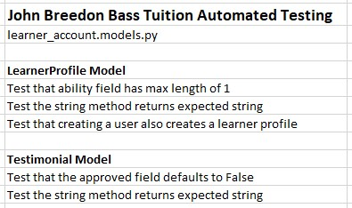

# John Breedon Bass Tuition - Testing

## Table of Contents
- [Manual Testing](<#features>)
	- [General](<#general>)
	- [JavaScript](<#javascript>)
	- [Python and Django](<#python-and-django>)
- [Automated Testing](<#automated-testing>)
	- [Forms](<#forms>)
	- [Models](<#models>)
	- [Views](<#views>)
	- [Coverage](<#coverage>)
	- [Bugs](<#bugs>)
- [Validation Testing](<#validation-testing>)
	- [HTML](<#html>)
	- [CSS](<#css>)
	- [JavaScript](<#javascript>)
	- [Python](<#python>)
	- [Accessibility](<#accessibility>)
	- [Performance](<#performance>)

## Manual Testing

The manual testing can be seen in the manual testing spreadsheet here. TO INPUT

### General

I performed manual testing of the site on a variety of browsers on desktop (Chrome, Firefox, Edge), and on Chrome on my mobile device.

In addition, I shared the website with numerous friends and family for user testing on different devices. The testing revealed no bugs, but did inform some minor layout and styling changes.

The specific tests performed are below:

General tests

### JavaScript

As well as the general testing, I performed some specific JavaScript testing to ensure that each function I had written worked as intended.

I approached this by working through my JavaScript file and writing a test for each function I had written, making sure that everything was covered.

The specific tests performed are below:

JavaScript tests

### Python

For the final part of the manual testing, I performed some specific Python and Django tests to cover scenarios that I could not reliably cover in automated testing. This included ensuring that the admin site worked as intended, and that templates elements that are logic dependant render in the relevant scenario.

These tests covered the parts of the code that are not covered in the automated testing (as highlighted by the coverage report).

I approached this by working through my JavaScript file and writing a test for each function I had written, making sure that everything was covered.

The specific tests performed are below:

Python tests

## Automated Testing

The automated testing can be seen in the automated testing spreadsheet here. TO INPUT

I wrote automated tests for all forms, models, and views. The specific tests can be seen below, because there are three django apps I have grouped the testing screenshots by type (i.e. forms, models then views).

### Forms

Automated Forms tests

### Models

Automated Models tests

### Views

Automated Views tests

### Coverage

For each app I used the `coverage` tool to run a report to see how much of the code had been covered in the testing. Each app's report can be seen below. Note that each report shows the admin.py as not being 100% covered, to account for this I completed some manual tests (as described above).

Bookings Coverage

Home Coverage

Learner Account Coverage

### Bugs

**Rendering Bookings Bug**

When writing my automated tests, I found that the test for rendering bookings on the account kept failing, despite my manual testing suggesting it was working. The learner_account.html template receives a context variable that is all the bookings that are linked to that user. If the length of this variable is greater than 0, it iterates through them to render some html elements.

Originally the code looked as follows:
~~~

	
		<Add html elements>
	

~~~  
`len` had been incorrectly used, but was not apparent through manual testing. After the automated testing, I updated the template code to instead use a Django filter:
~~~

	
		<Add html elements>
	

~~~

## Validation

The validation testing can be seen in the validation testing spreadsheet here. TO INPUT

### HTML

I ran each page of the site through the W3C HTML validator. To ensure it was properly validated, I inspected the page source of each page, and copied the content directly into the validator.

The results can be seen below, I discuss how I resolved the errors further down:

HTML Validation

#### Errors

**Form Tag**

On the home page I initially received the error: "Saw a form start tag, but there was already an active form element. Nested forms are not allowed. Ignoring the tag."

This occurred because crispy forms was rendering a form tag as well as there being a form tag in the HTML. I resolved this by changing the crispy forms template to not output the form tags.

**Attribute Placeholder**

On the bookings page I received the error: "Attribute placeholder not allowed on element select at this point."

This occurred because I was using the bootstrap5 component 'floating fields' which requires a placeholder attribute to be in place to work. To resolve this I changed the impacted fields to not use the 'floating label' component, instead opting for standard labels.

**Attribute Disabled**

On the learner account page I received the error: "Bad value True for attribute disabled on element select."

This occurred because when configuring the crispy form layout for the form, I had set the 'disabled' property to True. This was rendering the disabled attribute as having a value. To resolve this I changed the 'disabled' property in the crispy form layout to a blank string instead.

### CSS

I ran my CSS file through the Jigsaw CSS Validator, and this returned no errors and one warning. The warning is that the hover state for a button has the same background and border colour, this style is intentional so the warning was ignored.

In addition I have a style element in the home.html template in order to be able to render a background image (see the main README Bugs section for why this is not in the linked style.css). I also validated this style element and it returned no errors.

CSS Validation

### JavaScript

The JavaScript code was run through JSHint configured to 'assume new JavaScript features (ES6)'. Whilst this didn't produce any errors, it did produce one warning, one undefined variable, and one unused variable:

**Warning**

The warning was: Functions declared within loops referencing an outer scoped variable may lead to confusing semantics. (confirmDelete, urlId)

This warning is still present, but to mitigate the issue I have added comments to the code in question to make its purpose clear

**Undefined variable**

The undefined variable is: bootstrap

This was noted due to the fact that it is defined the bootstrap JavaScript file, so this is a false positive and I ignored it.

**Unused variable**

The unused variable is: confirmForm

The confirmForm function is called directly within the HTML via the form's onsubmit attribute, so this is a false positive and I ignored it.

JavaScript Validation

### Python

Each file was passed through a PEP8 compliance checker. None of the files returned any errors or warnings:

Python Validation

### Accessibility

Each page was assessed using the WAVE accessibility tool, which found 3 errors across all of the pages.

**Bookings Contrast Errors**

This error was returned as the helper text under the fields on the booking form did not have sufficient contrast with the background. I darkened the colour of the text to resolve this.

**Missing label**

This error was returned as the testimonial form on the account page did not have a label showing as I had opted to hide it. To increase the accessibility and remove this error, I unhid the label.

**Skipped Heading**

This error was returned as I had used an `<h4>` without using an `<h3>`. To resolve this I changed the h4 elements into h3 elements.

Accessibility Validation

### Performance

To validate the performance I ran each page through Lighthouse. This revealed no issues and the lowest rating in any category across all pages was 97.

Performance Validation

